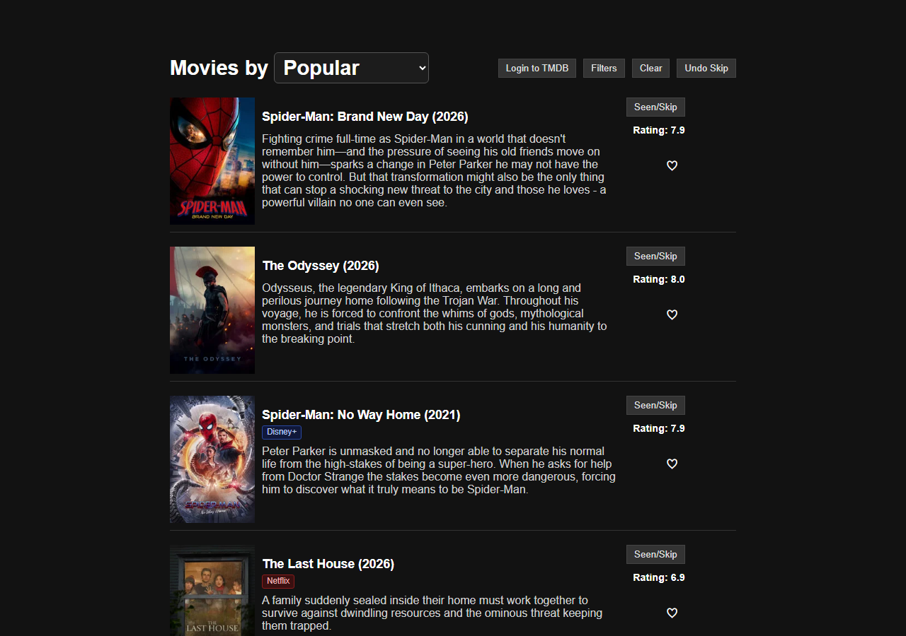
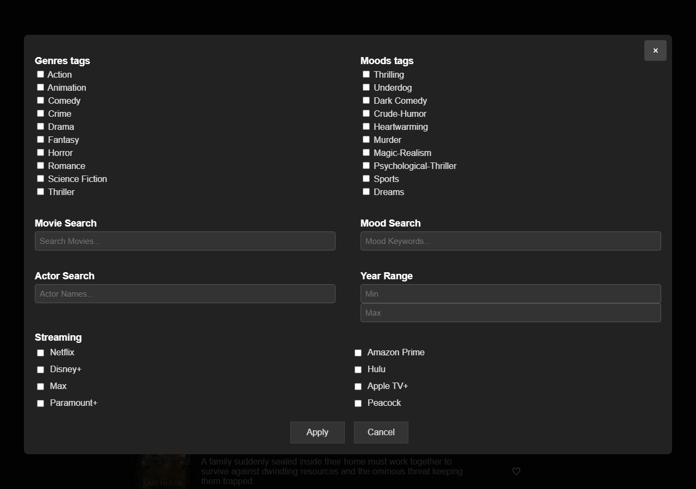

# Movies

A personal movie browser. Scroll popular titles, filter by genre, mood, actor, year, or streaming service, sort the list, skip what you have seen, and save favorites to your TMDB account.

This repo does **not** include a TMDB API key.

## Screenshots

The main list, with sort, trailers on the poster, and where-to-watch labels:



Filters for genre, mood, search, year, and streaming services:



## Get a TMDB API key

1. Create a free account at [themoviedb.org](https://www.themoviedb.org/signup).
2. Open [API settings](https://www.themoviedb.org/settings/api) and request a developer key.
3. Copy the **API Key** (the short v3 key, not the access token).

## Run it locally

1. Copy `config.example.js` to `config.js`.
2. Paste your key:

   ```js
   window.TMDB_API_KEY = 'your_key_here';
   ```

3. Open `movies.html` in a browser (or `index.html`, which goes there automatically).

If `config.js` is missing, the app asks for the key once and saves it in this browser only.

## How to use

- **Sort** — the menu next to “Movies by”: Popular, Top rated, Newest, Hidden gems.
- **Filters** — genres, moods, title / actor / mood search, year range, and streaming (Netflix, Prime, Disney+, Hulu, Max, Apple TV+, Paramount+, Peacock).
- **Poster** — play the trailer.
- **Title** — similar movies.
- **Seen/Skip** — hide a title. **Undo Skip** brings back the last one.
- **Heart** — favorite. Log in to TMDB to sync favorites and skipped movies across devices.

**Clear** resets filters. It does not change the sort.

## Host it on Cloudflare Pages

The GitHub repo is already set up for this. Cloudflare will pull from GitHub, so `config.js` (your API key) is never uploaded.

1. Open [Workers & Pages](https://dash.cloudflare.com/?to=/:account/workers-and-pages) and sign in (create a free account if you need one).
2. **Create** → **Pages** → **Import an existing Git repository** (or **Connect to Git**).
3. Authorize GitHub if asked, then choose **`bigjokker/movie-app`**.
4. Use these settings:

   | Setting | Value |
   | --- | --- |
   | Project name | `movie-app` (or any name you like) |
   | Production branch | `master` |
   | Framework preset | None |
   | Build command | `exit 0` |
   | Build output directory | `/` |

5. Click **Save and Deploy**.

When it finishes you get a URL like `https://movie-app.pages.dev`. Open that, paste your TMDB API key once, and the movies load. That key stays in that browser only.

On iPhone: open the URL in **Safari** → **Share** → **Add to Home Screen**.

Later pushes to `master` update the live site automatically.

## Privacy

`config.js` is listed in `.gitignore` on purpose. Never commit an API key.

This key was in an older local copy of the app. If you ever shared that file, create a new key in TMDB settings and use the new one.
